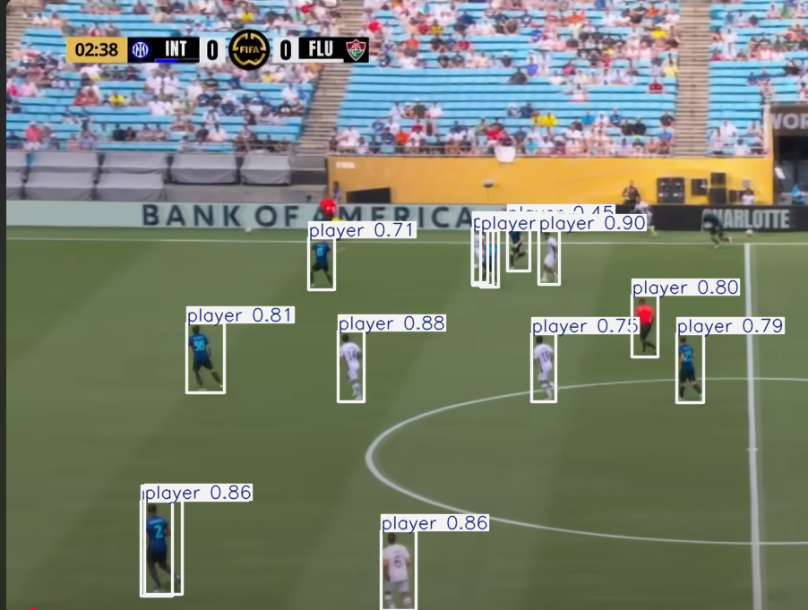
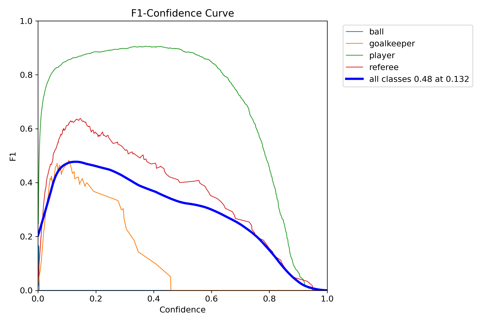
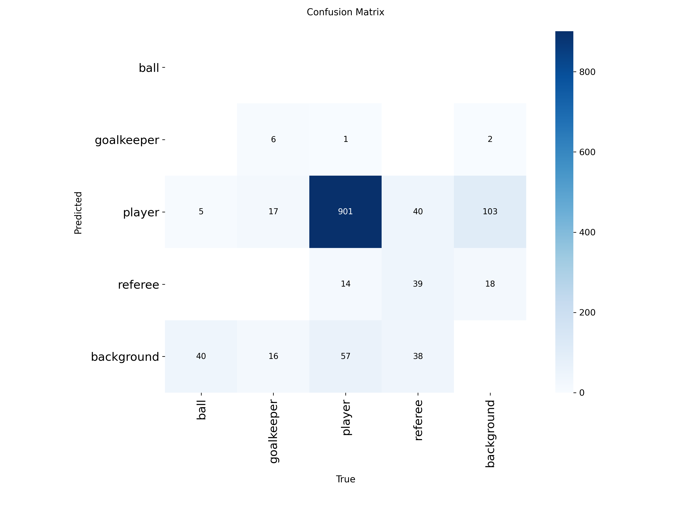
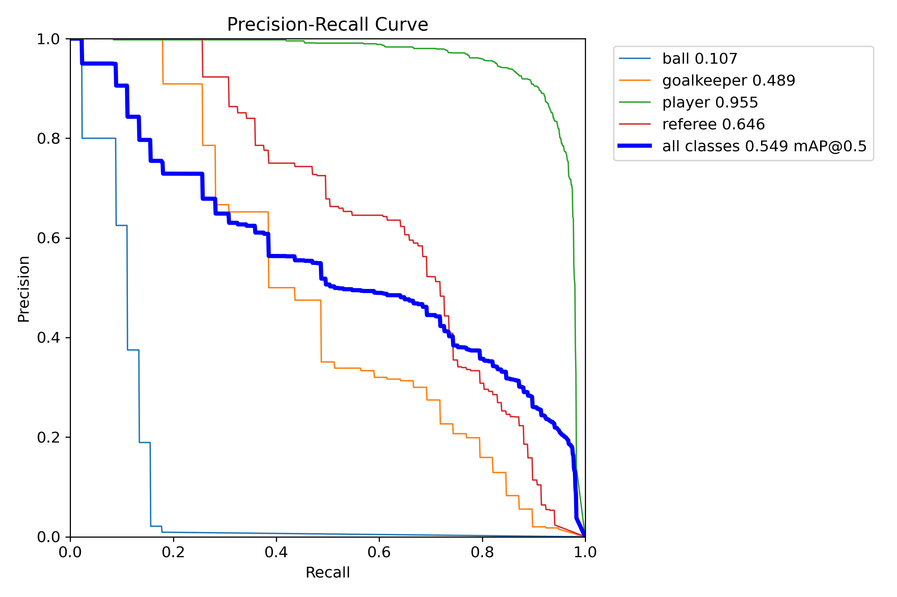

# 🧠 YOLOv8 - Detecção de Objetos em Imagens com Ultralytics

Este projeto utiliza o modelo YOLOv8 da [Ultralytics](https://github.com/ultralytics/ultralytics) para treinar uma rede neural capaz de detectar objetos como **jogadores**, **árbitros**, **goleiros** e **bolas** em imagens de partidas de futebol.

---

## 📦 Instalação

Antes de tudo, instale a biblioteca Ultralytics:

```bash
pip install ultralytics
```

---

## 🧠 Treinamento do Modelo

O modelo `yolov8n.pt` (versão nano do YOLOv8) foi utilizado como base para o treinamento.

```python
from ultralytics import YOLO

model = YOLO('yolov8n.pt')

metrics = model.train(
    data='/content/extraido/data.yaml',  # Caminho para seu arquivo de configuração de dados
    epochs=20,
    imgsz=640,
    patience=5
)
```

### ✅ Resultados do Treinamento

Após o treinamento, os seguintes resultados foram obtidos:

| Classe      | Precisão | Revocação | mAP50 | mAP50-95 |
|-------------|----------|-----------|-------|----------|
| ball        | 1.000    | 0.000     | 0.107 | 0.034    |
| goalkeeper  | 0.647    | 0.308     | 0.489 | 0.279    |
| player      | 0.789    | 0.954     | 0.955 | 0.620    |
| referee     | 0.617    | 0.650     | 0.646 | 0.352    |
| **Todos**   | 0.763    | 0.478     | 0.549 | 0.321    |

📂 Resultados salvos em: `runs/detect/train`

---

## 📸 Inferência em Imagens

Use o modelo treinado para detectar objetos em novas imagens:

```python
from ultralytics import YOLO
import cv2

model = YOLO("/content/runs/detect/train/weights/best.pt")

image_path = "/content/fluminense.png"

results = model(image_path)

# Exibe o resultado com as detecções
results[0].show()

# Salva o resultado como imagem
results[0].save(filename="resultado.jpg")

# Exibe informações das detecções
for box in results[0].boxes:
    cls = int(box.cls[0])
    conf = float(box.conf[0])
    print(f"Classe: {model.names[cls]}, Confiança: {conf:.2f}")
```

---

## 📁 Estrutura esperada do dataset

Certifique-se de que seu `data.yaml` aponta corretamente para os diretórios com as imagens e os rótulos no formato YOLO.

Exemplo do `data.yaml`:

```yaml
train: /caminho/para/train/images
val: /caminho/para/val/images

nc: 4
names: ['ball', 'goalkeeper', 'player', 'referee']
```

---

## 🚀 Requisitos

- Python 3.11+
- [Ultralytics](https://github.com/ultralytics/ultralytics)
- Torch (instalado automaticamente com Ultralytics)
- CUDA (opcional, recomendado para acelerar o treinamento)

---

## 📌 Observações

- O modelo foi treinado em uma GPU Tesla T4 com CUDA.
- Resultados podem variar dependendo da qualidade e tamanho do dataset.

---

## 📷 Exemplo de Resultado



## 📊 Avaliação do Modelo

Abaixo estão as principais métricas visuais utilizadas para analisar o desempenho do modelo YOLOv8 treinado neste projeto.

### 🔵 Curva F1 x Confiança

A curva abaixo mostra a relação entre o valor de confiança das detecções e a pontuação F1, permitindo identificar o melhor ponto de corte de confiança para maximizar o equilíbrio entre precisão e revocação:



- O melhor ponto de corte (threshold) está em 0.132 com F1 ≈ 0.48.
- A classe `player` apresenta o melhor desempenho geral.
- A classe `ball` possui baixa performance devido à escassez ou dificuldade de detecção.

---

### 🔵 Matriz de Confusão

A matriz de confusão abaixo apresenta como as classes foram confundidas entre si. Quanto mais escura a célula diagonal, melhor a performance para aquela classe:



- `player` tem ótima taxa de acerto (901 predições corretas).
- `referee` e `goalkeeper` apresentam confusão com outras classes e com o fundo (`background`).
- Há grande confusão entre `referee` e `player`.

---

### 🔵 Curva Precisão x Revocação (Precision-Recall)

Esta curva mostra como o modelo equilibra precisão e revocação ao longo de diferentes limiares:



- `player` novamente demonstra excelente desempenho com mAP@0.5 = 0.955.
- `referee` e `goalkeeper` têm desempenho intermediário.
- A classe `ball` é a mais difícil de detectar com precisão (mAP@0.5 = 0.107).

